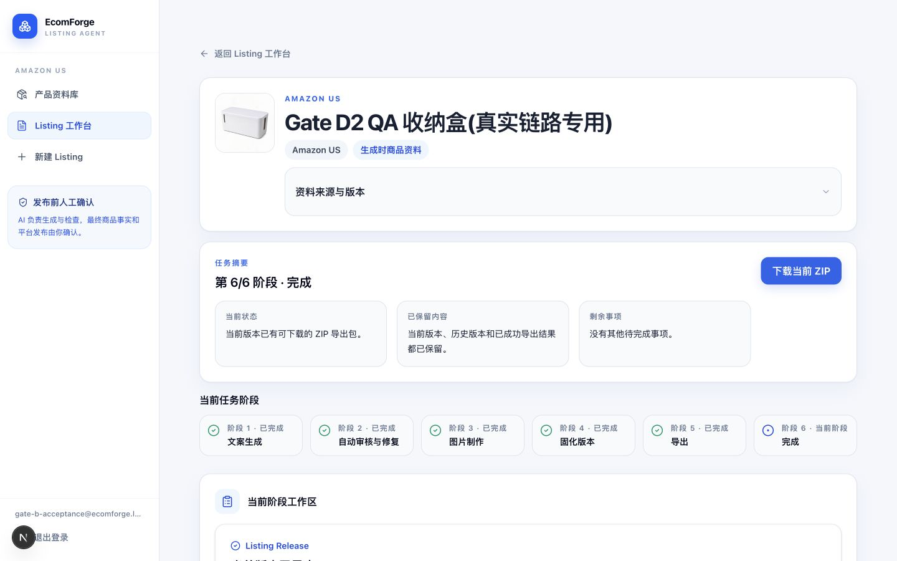
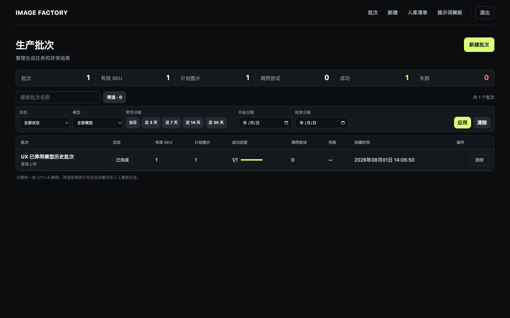
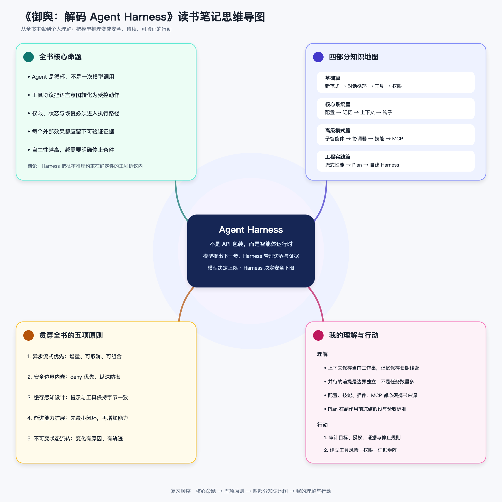

  

<h1 align="center">Hi, I'm wonderbell.</h1>

  <strong>I build AI agent systems for real-world work.</strong> 
  我构建能进入真实业务流程的 AI Agent 系统。

  <code>evidence → judgment → action → result</code>

## What I build

My projects span commerce, product research, creative operations, knowledge workflows, and software delivery. The shared focus is the system around the model:

- stateful workflows that can pause, recover, and continue;
- tools and permissions with explicit operating boundaries;
- traceable evidence, revisions, decisions, and outputs;
- human approval where cost, risk, or publication is involved.

## Selected systems

### EcomForge · Agent-assisted commerce

Turns product truth into traceable Amazon listing and creative-production workflows. Product revisions, working drafts, reviews, releases, and historical outputs remain connected instead of being overwritten.

`Private Beta` · `Selected components planned for open source`

### Image Factory · Creative operations

A production workspace for multi-model generation, durable jobs, batch operations, human review, and cost-aware execution.

`Production` · `Private case study`

### PickScout Agent · Evidence-driven research

Transforms market signals, unit economics, and operating constraints into explainable product-opportunity decisions instead of opaque recommendations.

`Product validation` · `Open-source direction under review`

### Agent systems research · Knowledge and method

Working notes on agent harnesses, context, tools, permissions, state, recovery, and verification—turning model reasoning into dependable action.

`Writing in progress`

## Open source

- [gpt56-superpowers](https://github.com/bells0/gpt56-superpowers) — lean, outcome-first delivery skills for GPT-5.6 Sol and Codex. `MIT`
- **Wonderbell Skills** — reusable Codex skills and operating principles. `Preparing for open source`

## Current focus

Building reusable Agent-system foundations, then validating them in concrete operating contexts. I write about the decisions, evidence, and failures behind the systems—not only the final interface.

  <a href="https://bells0.github.io">Portfolio & field notes</a> ·
  <a href="https://github.com/bells0?tab=repositories">Repositories</a>

